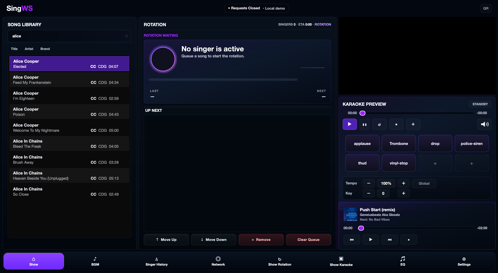

# SingWS

**Professional karaoke host software for KJs and venues.**

SingWS is a Python/PyQt desktop application that handles everything a live karaoke host needs: song playback with realtime key and tempo control, singer rotation management, and live song request intake from singers via a companion web app.



---

## Features

- **Gapless playback** — MP3+CDG and video karaoke tracks via GStreamer
- **Realtime key & tempo** — pitch shift and time-stretch without re-encoding, powered by [Signalsmith Stretch](https://signalsmith-audio.co.uk/code/stretch/)
- **CDG rendering** — hardware-accelerated lyrics display synchronized to audio
- **Singer rotation** — drag-and-drop queue, per-singer song history, skip/move controls
- **Song library** — SQLite-indexed catalog with instant search across 100k+ tracks
- **Live requests** — pulls singer requests from the SingWS web server in real time
- **Background music** — BGM playlist that auto-fades when a karaoke track starts
- **Dark themed UI** — QML interface, accent color customizable per venue

---

## Requirements

- macOS 12+ (Apple Silicon or Intel) — primary target
- Windows 10/11 — also supported
- Python 3.11+
- GStreamer 1.x (with `gst-plugins-good`, `gst-plugins-bad`, `gst-plugins-ugly`)
- PyQt6
- Optional: `psutil` for system info logging

---

## Installation

### macOS (Homebrew)

```bash
# Install GStreamer
brew install gstreamer gst-plugins-base gst-plugins-good gst-plugins-bad gst-plugins-ugly

# Install Python dependencies
pip install PyQt6 psutil

# Clone and run
git clone https://github.com/DanDemolition/SingWS.git
cd SingWS
python 0.2.18.1.py
```

### macOS (Universal .app bundle)

Download the latest release from the [Releases](https://github.com/DanDemolition/SingWS/releases) page and drag `SingWS.app` to your Applications folder.

### Windows

```bash
pip install PyQt6 psutil

# GStreamer MSI installer from https://gstreamer.freedesktop.org/download/
# Install both the runtime and development packages to the default path

python 0.2.18.1.py
```

---

## Building a Release

```bash
# Universal macOS .app + .dmg
./build_all.sh

# Universal binary only (arm64 + x86_64 lipo'd)
./build_universal.sh
```

The build scripts use PyInstaller under the hood. The resulting `.app` bundles GStreamer plugins and all Python dependencies — no external installs needed for end users.

---

## Architecture

```
SingWS/
├── 0.2.18.1.py               # Main application entry point & UI bridge
├── python_karaoke_transport.py  # GStreamer playback engine
├── bass_background_engine.py    # BGM playback (BASS library)
├── qml/
│   └── AppShell.qml          # Main QML UI shell
├── vendor/
│   ├── bass/                 # BASS audio library (BGM)
│   ├── rubberband/           # Rubber Band Library (submodule)
│   ├── signalsmith-stretch/  # Signalsmith Stretch DSP (submodule)
│   └── pybind11/             # Python <-> C++ bindings (submodule)
├── native/
│   └── signalsmith_audio_native.cpp  # C++ pitch/time-stretch bridge
└── design/                   # UI mockups and DMG artwork
```

**Python/PyQt** owns the UI, app flow, rotation logic, and song indexing.
**Native C++ modules** own realtime audio processing, pitch/time DSP, and low-latency transport.

---

## Web Requests Integration

SingWS polls a companion web server for live song requests from singers. Singers open the web app on their phone, sign up, and submit requests — SingWS picks them up automatically and adds them to the rotation.

The web server is a separate PHP/SQLite application compatible with the **OpenKJ** request server API. Configure the server URL in the app settings.

---

## License

See [LICENSE](LICENSE).
